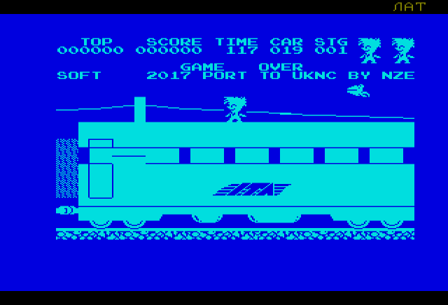

# uknc-stopexpress
Porting game Stop the Express to UKNC, work in progress.

The game for ZX Spectrum was written by Hudson Soft and published back in 1983.
In 1990 the game was ported to Elektronika MS-0515 (PDP11-like computer based on T11 clone) by unknown programmer in Lwow (Ukraine).
And finally in March 2017 I started to port the game to UKNC.

Screenshots of the ported version:

Screenshot of the original game on MS-0515:

#### See Also

 - [Porting BK game Lode Runner to UKNC](https://github.com/nzeemin/uknc-loderunner)
