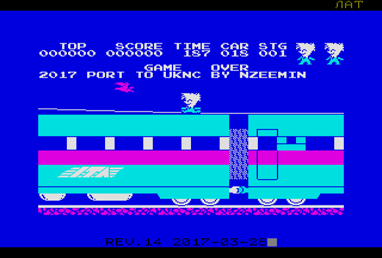
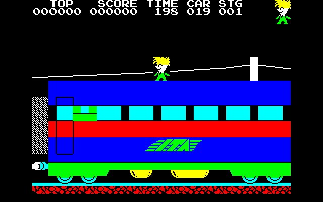

# uknc-stopexpress
Porting game Stop the Express to UKNC, work in progress.

The game for ZX Spectrum was written by Hudson Soft and published back in 1983.
In 1990 the game was ported to Elektronika MS-0515 ("Электроника МС-0515", soviet PDP11-like computer based on T11 clone) by unknown programmer in Lwow (Ukraine).
And finally in March 2017 I ported the game to UKNC (УКНЦ, another PDP11-like soviet machine).

Screenshots of the ported version:

 

Video for demo mode:

Screenshot of the original game on MS-0515:

#### See Also

 - ["Stop the Express" at WoS](http://www.worldofspectrum.org/infoseekid.cgi?id=0004916)
 - [Porting BK game Lode Runner to UKNC](https://github.com/nzeemin/uknc-loderunner)
 - [UKNCBTL emulator](https://github.com/nzeemin/ukncbtl)
